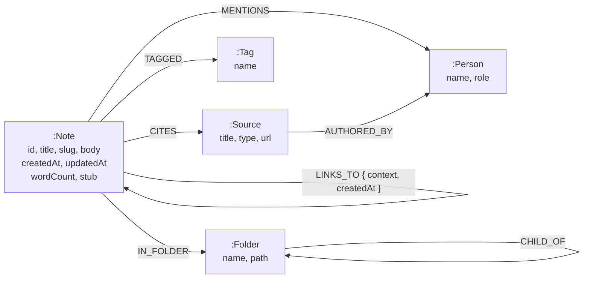

# Vault — an Obsidian-style knowledge graph on CognoDB

A personal knowledge vault where notes are connected by `[[wikilinks]]`, and the connections
are the data rather than an afterthought. Write notes, link them, and the app answers the
questions a folder of markdown files cannot: *what links here, how are these two ideas
connected, and which notes should I have linked but didn't?*

Built for the Wexa AI take-home assignment. The database is [CognoDB](https://cognodb.com) —
a managed graph database that speaks openCypher over Bolt 5.0–5.4 and works with the official
Neo4j drivers unmodified.

<!-- SCREENSHOT: main reading view with sidebar, note, backlinks and the graph pane -->

---

## The use case

Note-taking apps are where good ideas go to be forgotten. You write something, file it in a
folder, and never see it again — because a folder can only answer *"what did I put here?"*

The interesting questions about a body of notes are all about **relationships**:

- What else references this idea, and in what context?
- How is my note on attention connected to my note on legibility?
- Which two notes cite the same book, discuss the same person, and yet have never been
  linked to each other?
- Which notes are orphaned — connected to nothing, and therefore effectively lost?

Every one of those is a traversal. None of them is a row lookup.

### Why a graph database?

The honest test is not "can a relational schema store this" — it can. The test is what
happens to the *queries*.

**1. "How are these two notes connected?" is one clause here and a research project in SQL.**

```cypher
MATCH trail = shortestPath((from)-[:LINKS_TO|CITES|MENTIONS|AUTHORED_BY*1..8]-(to))
```

The engine runs a bidirectional breadth-first search and stops the moment the two frontiers
meet. The relational equivalent is a recursive CTE that unions four junction tables at every
level, carries a visited-set to avoid cycling, materialises every path up to length 8 in a
graph where each level multiplies the row count, then takes the minimum — and it *still*
cannot tell you which edges the winning path used without dragging the whole chain along as
an array.

Here is a real answer from the seeded vault:

> **Attention Is a Moral Act** → *links to* → **The Attention Economy** → *mentions* →
> **Donella Meadows** → *mentioned by* → **The Tragedy of the Commons** → *links to* →
> **Legibility and Its Costs**

Two notes in different folders, connected through a person neither note is about. Nobody
would find that by hand.

**2. Depth is a runtime parameter, not a schema decision.**

The local graph view has a depth slider. In Cypher that is one variable-length pattern. In
SQL, each hop is another self-join written at authoring time — a 3-hop query is a physically
different query from a 2-hop one, so "let the user choose the depth" means writing every
variant in advance.

**3. Suggested links are one pattern instead of a three-way UNION.**

"Notes that share at least two tags, people or sources with this one, but that nothing links
to it" traverses out to shared entities and back in again:

```cypher
MATCH (n:Note {slug: $slug})-[:TAGGED|MENTIONS|CITES]->(shared)<-[:TAGGED|MENTIONS|CITES]-(other:Note)
WHERE n <> other AND NOT (n)-[:LINKS_TO]-(other)
```

Relationally that is a UNION across three separate junction tables, self-joined, with a NOT
EXISTS against a fourth. The graph version reads like the sentence that describes it.

**4. The model can grow without a migration.**

Adding `CITES` to connect notes to sources needed no schema change and no downtime — just a
new relationship type. Relationally it is a new table, a migration, and an update to every
query that wants to traverse through it.

**Where a relational database would genuinely be better:** aggregate reporting over note
metadata ("word count per folder per month") is plainer in SQL, and if this app only ever
needed backlinks — a single hop — the graph would be overkill. The multi-hop questions are
what earn it.

---

## Data model



Two modelling decisions worth calling out.

**`context` lives on the `LINKS_TO` relationship**, not on either note. It stores the
sentence the link appeared in, which is what makes the backlinks panel readable — you see
*why* something links here, not just that it does. The fact is about the edge, so it belongs
on the edge. Relationally this forces a junction table carrying a payload column.

**Unresolved links create real nodes.** Typing `[[A Note I Have Not Written]]` MERGEs a
`:Note {stub: true}`. That is Obsidian's greyed-out link, and it falls out of the graph model
for free — the edge has to point at *something*, so the placeholder is the natural
representation. Writing that note later flips the flag; no re-linking pass is needed. Deleting
a note that others still link to turns it back into a stub rather than dangling their edges.

### Seeded vault

| | |
|---|---|
| Notes | 187 |
| Links | 762 (4.1 per note) |
| Graph | 273 nodes, 1666 edges |
| Tags · People · Sources | 25 · 18 · 30 |
| Folders | 13, nested three deep |

The vault is a Zettelkasten on writing, learning, systems thinking, stoicism and a couple of
side projects. It is deliberately structured: dense thematic clusters, a handful of genuine
orphans, ~20 pairs that share entities but are not linked (so the suggestion engine has real
work to do), and several long cross-cluster bridges that only exist through a shared author
or book.

---

## The queries

All nine live in `lib/queries/`, one exported function each, every one parameterised.

| # | Function | What it does |
|---|---|---|
| 1 | `getBacklinks` | Inbound links with the sentence each appeared in |
| 2 | `getLocalGraph` | **Multi-hop** — variable-length traversal, depth 1–3 |
| 3 | `findPath` | **Awkward in SQL** — shortest path between two notes |
| 4 | `getSuggestedLinks` | Unlinked notes sharing ≥2 tags/people/sources |
| 5 | `getOrphans` | Notes with nothing linking in or out |
| 6 | `getHubs` | Most-connected notes, by in/out degree |
| 7 | `getFolderTree` | Recursive folder hierarchy with ancestry |
| 8 | `searchNotes` | Full-text BM25, with a `CONTAINS` fallback |
| 9 | `getGlobalGraph` | The whole vault, filterable by relationship type |

### Notes on three of them

**`getLocalGraph` — the multi-hop requirement.** Cypher does not allow a parameter as a
variable-length bound: `*1..$depth` is a syntax error. So the query uses a literal ceiling
and filters by path length:

```cypher
MATCH path = (n:Note {slug: $slug})-[:LINKS_TO|TAGGED|MENTIONS|CITES*1..3]-(m)
WHERE length(path) <= $depth
```

Depth is clamped to 1–3 server-side, because a value larger than the literal ceiling would
silently do nothing while looking like it worked. Verified: depth 1 returns 19 nodes, depth 2
returns 113.

**`findPath` deliberately excludes `TAGGED`.** This is the single most important decision in
the query layer. A tag is a category, not a connection — with 25 tags over 187 notes, any two
notes sharing one are two hops apart, so including tags makes almost every pair "connected"
through a hub like `#learning`. Technically a path; tells you nothing. Restricting the search
to `LINKS_TO`, `CITES`, `MENTIONS` and `AUTHORED_BY` means every returned path is a specific
claim.

**`getHubs` uses pattern comprehension, not `count {}`.** `count {}` is Neo4j 5 syntax and
CognoDB does not document its Cypher version, so `size([(n)-[:LINKS_TO]->(:Note) | 1])` is
used instead — it works on both 4.x and 5.x.

### Running against CognoDB: what actually differs

CognoDB's documentation is thin, so the app was built defensively and then tested against a
real free-tier instance (`c0`, us-east4, v0.9.9). Three things turned up that are worth
knowing, and all three are handled in code rather than in a caveat.

**1. Pattern predicates are wrong when both endpoints are bound variables.**

This is the significant one, because it fails *silently*. On CognoDB:

```cypher
MATCH (a:Note {slug:'deliberate-practice'}), (b:Note {slug:'chunking'})
WHERE NOT (a)-[:LINKS_TO]-(b)     -- returns 0 rows
WHERE     (a)-[:LINKS_TO]-(b)     -- returns 1 row
```

Those two notes have **no** relationship between them, confirmed by a direct `MATCH`. So the
negated form should match and the positive form should not — CognoDB returns the opposite of
the truth for both. `NOT EXISTS { ... }` is wrong the same way. No error is raised.

It cost the suggested-links feature: every candidate was filtered away and the panel just
looked empty. The fix collects the note's linked neighbours first and filters with `NOT IN`,
which uses only ordinary traversal:

```cypher
MATCH (n:Note {slug: $slug})
OPTIONAL MATCH (n)-[:LINKS_TO]-(neighbour:Note)
WITH n, collect(DISTINCT neighbour.slug) AS linked
MATCH (n)-[:TAGGED|MENTIONS|CITES]->(shared)<-[:TAGGED|MENTIONS|CITES]-(other:Note)
WHERE other.slug <> n.slug AND NOT other.slug IN linked
```

Pattern predicates with an **anonymous or label-only** endpoint — `NOT (n)-[:LINKS_TO]-()`,
used by the orphan query and the unused-tag sweep — are unaffected and return correct results.
Only the both-ends-bound form is broken, and only one query in this codebase used it.

**2. Full-text search is advertised but not available.** `CREATE FULLTEXT INDEX` is accepted
without complaint; querying it then fails with *"fulltext indexes are not available on this
server"*. Because the DDL succeeds, creating the index is not evidence it works — the seed
script probes it with a real query and reports what is actually true. `searchNotes` detects
this once at startup and falls back to `toLower(...) CONTAINS`, logging which path is live.

**3. No APOC, no GDS.** Neither is advertised and neither exists, so every query here is
pure Cypher with no procedure-library dependency.

Constraint DDL is wrapped in try/catch for the same reason — the app must work without it.
All five constraints did apply on CognoDB.

### Performance on the free tier

Measured against the live `c0` instance, median of 3 runs:

| Query | Median |
|---|---|
| `getBacklinks` | 665 ms |
| `getSuggestedLinks` | 678 ms |
| `getInsights` | 670 ms |
| `searchNotes` (CONTAINS fallback) | 667 ms |
| `getLocalGraph` depth 2 | 786 ms |
| `getGlobalGraph` (273 nodes / 1,666 edges) | 788 ms |
| `getLocalGraph` depth 3 | 947 ms |

The striking thing is the **~664 ms floor**: the cheapest query and the one returning 1,666
edges differ by barely 120 ms. That floor is network round-trip from the development machine
to us-east4, not query execution — the same queries run in 5–25 ms against a local container.
Deploying the app to a US-East region puts it in the same region as the database and removes
that hop entirely, which is why the hosted demo is noticeably quicker than local development.

Worth noting for anyone extending this: the free tier caps results at **50,000 rows**. The
global graph query is the only one that could approach it, and at ~1,900 rows it has room.

---

## Running it

### 1. Create a CognoDB instance

Sign up at [console.cognodb.com/signup](https://console.cognodb.com/signup) — the free `c0`
tier needs no credit card. Create an instance and pick a region; it provisions in under a
minute.

You get a URI of the form `bolt+s://<instance-id>.databases.cognodb.cloud` and a generated
password for the user `cognodb`. **The password is shown exactly once** — copy it immediately.

### 2. Configure

```bash
cp .env.example .env.local
```

```dotenv
COGNODB_URI=bolt+s://<your-instance-id>.databases.cognodb.cloud
COGNODB_USER=cognodb
COGNODB_PASSWORD=<your-generated-password>
```

`.env.local` is gitignored. Credentials are read from the environment and are never committed;
missing variables fail fast at startup naming exactly which ones are absent.

### 3. Install, seed, run

```bash
npm install
npm run seed      # loads seed/vault/**/*.md into the graph
npm run verify    # proves all nine queries return data
npm run dev
```

`npm run verify` is worth running before anything else. A Cypher query with a subtly wrong
pattern does not throw — it returns zero rows, and an empty panel looks exactly like a
feature that is merely quiet. The script asserts each query returns data, that depth 2
genuinely reaches further than depth 1, and that at least one path routes through a `Person`
or `Source` node.

### Developing without CognoDB

The driver is the standard Neo4j one, so a local container works identically:

```bash
npm run db:up     # neo4j:5-community on bolt://localhost:7687
```

Then use the local credentials commented at the bottom of `.env.example`.

---

## How it is put together

```
app/
  api/                  route handlers — thin: validate, call a query, return
lib/
  db.ts                 the ONLY file that imports neo4j-driver
  types.ts              shared contracts — every route and component codes against these
  api.ts                handle() — turns any failure into { error: { code, message } }
  queries/              all Cypher, parameterised, one function per query
  wikilink.ts           [[link]] and #tag parsing, context-sentence extraction
components/
  shell/ sidebar/ note/ graph/ explore/ ui/
scripts/
  seed.ts               markdown → graph
  verify.ts             proves the queries work
seed/vault/**/*.md      the vault, as real markdown files
```

**`lib/db.ts` is the only file that imports the driver.** Everything above it works with
plain JavaScript values and a small set of error codes. That is what makes the layering hold:
no route or component ever has to know that Neo4j returns 64-bit integers as `{low, high}`
objects, because they are converted once at the boundary.

**Saving a note rewrites its relationships in one transaction** — MERGE the note, delete all
its outgoing `LINKS_TO`/`TAGGED`/`MENTIONS`/`CITES`, then recreate them from the parsed body.
Deleting and recreating rather than diffing is deliberate: it makes saving idempotent, and it
means a link you *removed* actually disappears.

### Error handling

Database failures are expected operationally, not exceptional. `lib/db.ts` maps them to typed
codes — `DB_UNREACHABLE`, `DB_AUTH`, `DB_TIMEOUT`, `CONFIG` — and the UI renders a styled
"Can't reach the vault" panel with a retry button instead of white-screening. Verified by
pointing `COGNODB_URI` at a dead host.

<!-- SCREENSHOT: the database-unreachable panel -->

---

## Demo

<!-- DEMO LINK -->
<!-- SCREEN RECORDING -->
