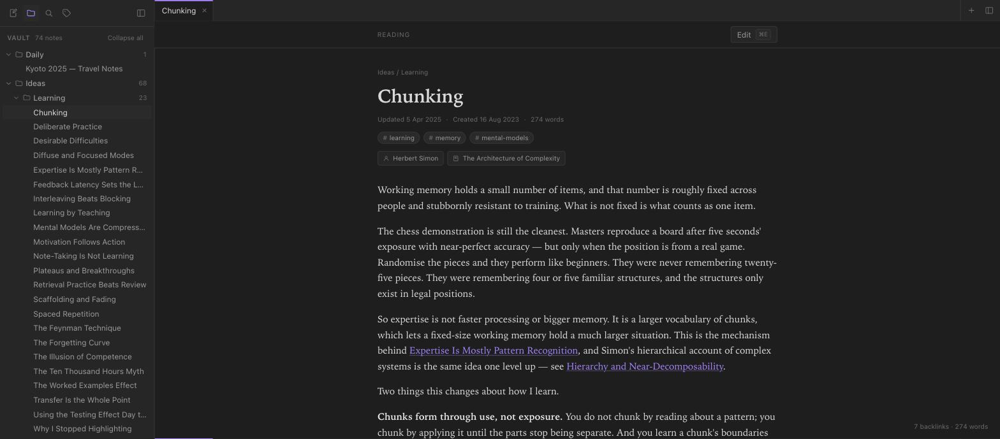
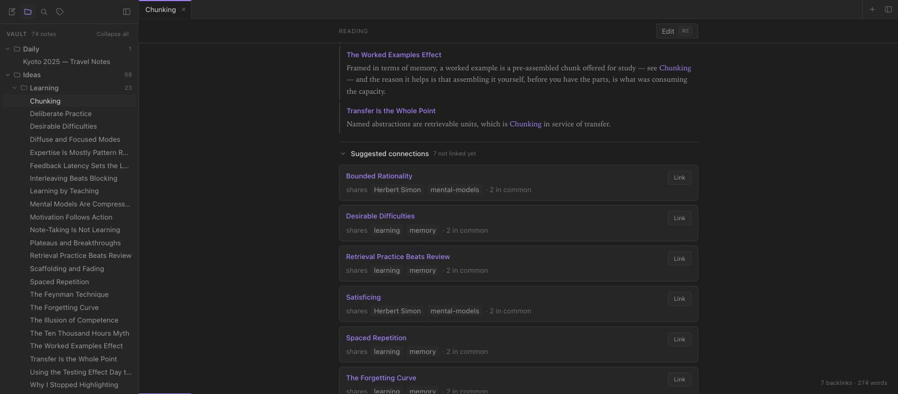
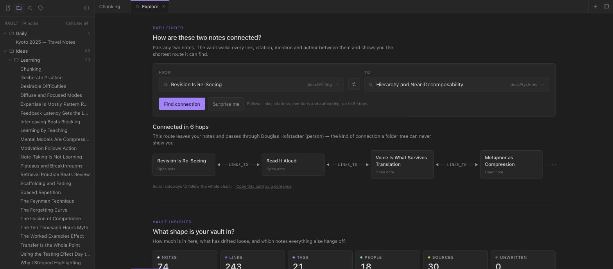
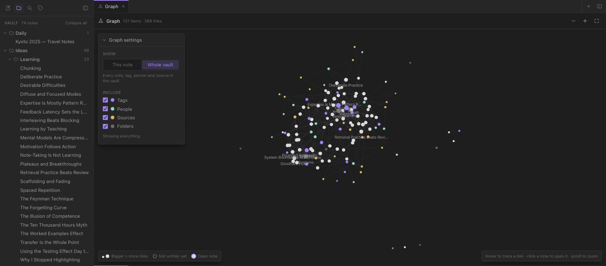
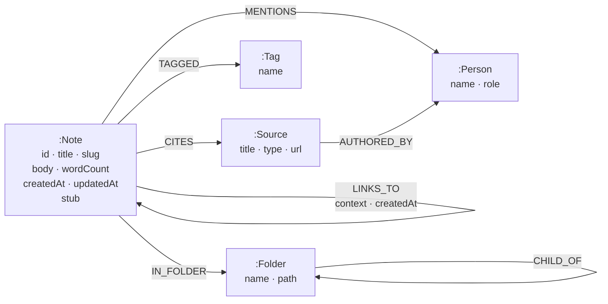
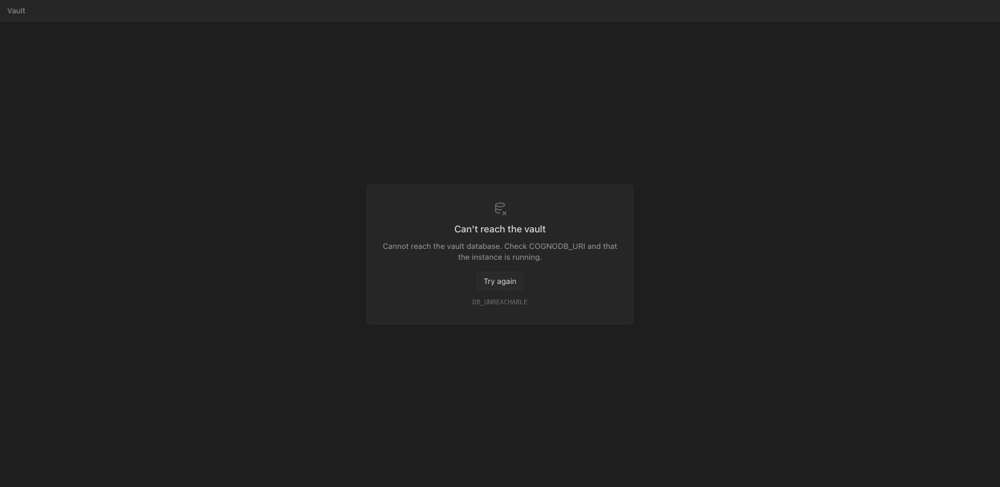

# Filament

A note-taking app where the **connections between your notes are the data**, not an
afterthought. Write notes, link them with `[[double brackets]]`, and the app answers the
questions a folder of files cannot: *what links here, how are these two ideas connected, and
which notes should I have linked but never did?*

**▶ Try it: [filament-notes.vercel.app](https://filament-notes.vercel.app)**

Modelled on [Obsidian](https://obsidian.md), backed by [CognoDB](https://cognodb.com) — a
managed graph database that speaks openCypher over Bolt.



> Built for the Wexa AI take-home assignment. The engineering rationale — data model, query
> design, and two CognoDB bugs found along the way — is in
> [Part 2: How it works](#part-2--how-it-works).

---

## Contents

- [The problem it solves](#the-problem-it-solves)
- [Part 1 — Using it](#part-1--using-it)
  - [A two-minute tour](#a-two-minute-tour)
  - [Writing and linking notes](#writing-and-linking-notes)
  - [The five features](#the-five-features)
  - [Keyboard shortcuts](#keyboard-shortcuts)
- [Running it yourself](#running-it-yourself)
- [Part 2 — How it works](#part-2--how-it-works)
  - [Why a graph database?](#why-a-graph-database)
  - [The data model](#the-data-model)
  - [The queries](#the-queries)
  - [Project structure](#project-structure)
  - [Running against CognoDB](#running-against-cognodb)
- [Troubleshooting](#troubleshooting)

---

## The problem it solves

Note-taking apps are where good ideas go to be forgotten. You write something down, file it in
a folder, and never see it again — because a folder only answers *"what did I put in here?"*

The questions actually worth asking about a body of notes are about **relationships**:

- What else references this idea, and in what context?
- How is my note on attention connected to my note on legibility?
- Which two notes cite the same book and discuss the same person, yet have never been linked?
- Which notes are orphaned — connected to nothing, and therefore effectively lost?

Every one of those is a traversal, not a row lookup. That is the entire reason this is built
on a graph database, and [Part 2](#why-a-graph-database) makes the case with real queries.

---

# Part 1 — Using it

## A two-minute tour

Open the [live demo](https://filament-notes.vercel.app). It comes preloaded with a
74-note vault about writing, learning and systems thinking, so there is something to explore
immediately. Do these three things in order:

**1. Read a note and look at its backlinks.**
In the sidebar open **Ideas → Learning → Chunking**, then scroll to the bottom. The
**backlinks** panel lists every note pointing at this one — and shows *the sentence the link
appeared in*, so you can see why the connection exists without opening anything.

**2. Ask how two ideas are connected.**
Open the **Explore** tab and press **Find connection**. It comes pre-filled with two notes
from different clusters. The answer is a chain, and it usually runs through a person or a book
rather than a direct link:

> The First Sentence Is a Contract → Narrative Versus Argument → Metaphor as Compression →
> Explain It To a Twelve-Year-Old → **Richard Feynman** → Learning by Teaching

Seven hops from a note about opening lines to a note about teaching. The only thing joining
the two halves is Feynman — and nothing in either note mentions the other subject.

**3. See the shape of the whole thing.**
Open the **Graph** tab. Bigger dots are more-connected notes. Switch to **This note** and drag
the depth slider from 1 to 3 to widen the neighbourhood around whatever you have open.

## Writing and linking notes

**Create** a note with the ✎ icon in the sidebar, or `⌘P` → type a new name.

**Edit** with `⌘E` (or the Edit button). It is plain markdown. Save with `⌘S`, or just click
away — it saves on blur.

**Link** to another note by typing its title in double brackets:

```markdown
This is why [[Deliberate Practice]] fails without fast feedback.
```

Two things happen the moment you save:

- The link becomes a real relationship in the database, so the target note immediately shows
  this note in *its* backlinks.
- The **sentence around the link** is stored with it. This is what makes the backlinks panel
  readable — you see the claim, not just a filename.

**Link to a note that doesn't exist yet** and that is fine — it renders greyed out with a
dotted underline, and appears in the graph as a faded node. It is a placeholder for something
you haven't written. Click it and you start writing it; the placeholder becomes the real note
with its incoming links already attached.

**Tags** are inline: write `#learning` anywhere in the body. Click any tag pill to filter the
sidebar.

## The five features

### 1. Backlinks with context · 2. Suggested connections



**Backlinks** sit at the bottom of every note: every note linking here, each with the sentence
it appeared in. Nothing to maintain — it is derived from the links themselves.

**Suggested connections** sit below them. The app looks for notes that **share things with
this one but aren't linked**, and tells you what they share:

> **Bounded Rationality** — shares *Herbert Simon*, *mental-models* · 2 in common

Click **Link** and it appends the `[[link]]` and saves. This is the feature Obsidian itself
does poorly, and it is the clearest reason the data lives in a graph: "reachable in two hops
through a shared entity, but not reachable in one hop directly" is a single query here.

### 3. Path finder — "how are these connected?"



In the **Explore** tab. Pick any two notes and it finds the shortest chain between them, with
the relationship type printed on each connector. People and sources are highlighted, because a
path routing through an author is exactly the kind of connection a folder tree can never show
you — above, two notes about prose are joined through **Douglas Hofstadter**.

If nothing connects them within 8 hops it says so plainly. That is an answer, not an error.

### 4. The graph



Every note plus the tags, people, sources and folders they connect to. Node size scales with
how connected a note is, so hubs are visible at a glance. Colours: **white** notes, **purple**
tags, **teal** people, **gold** sources, **grey** folders. The loose dots around the edge are
genuine orphans — notes that link to nothing.

Two modes — *Whole vault*, and *This note* with a depth slider (1–3). Use the **Graph
settings** checkboxes to hide tags or folders when it gets busy; unticking everything leaves
the pure note-to-note graph.

### 5. Vault insights

Also in **Explore**. Headline counts, plus:

- **Orphan notes** — connected to nothing. Either link them or let them go.
- **Hub notes** — your most-connected ideas, with inbound and outbound counts.

## Keyboard shortcuts

| Key | Does |
|---|---|
| `⌘P` / `Ctrl+P` | Quick switcher — search and jump to any note |
| `⌘E` / `Ctrl+E` | Toggle reading ↔ editing |
| `⌘S` / `Ctrl+S` | Save |
| `⌘click` a link | Open in a new tab |

---

## Running it yourself

### What you need

- **Node 20+** and npm
- Either a free **CognoDB** instance *or* **Docker** for a local database

### 1. Get a database

**Option A — CognoDB Cloud (what the demo uses).** Sign up at
[console.cognodb.com/signup](https://console.cognodb.com/signup) — the free `c0` tier needs no
credit card. Create an instance; it provisions in under a minute. You get a connection URI and
a password for the user `cognodb`.

> ⚠️ **The password is shown exactly once.** Download the credentials file when prompted — it
> cannot be recovered afterwards.

**Option B — Docker, no signup.** The app uses the standard Neo4j driver, so a local container
works identically:

```bash
npm run db:up      # starts neo4j:5-community on bolt://localhost:7687
```

### 2. Configure

```bash
cp .env.example .env.local
```

Fill in `.env.local`:

```dotenv
COGNODB_URI=bolt+s://<your-instance-id>.databases.cognodb.com
COGNODB_USER=cognodb
COGNODB_PASSWORD=<your-generated-password>
```

For the Docker option, use the local values commented at the bottom of `.env.example`.

`.env.local` is gitignored. If a variable is missing the app fails at startup and names
exactly which one, rather than surfacing later as a confusing auth error.

### 3. Install, seed, run

```bash
npm install
npm run seed      # loads the 74-note vault from seed/vault/**/*.md
npm run verify    # proves every query returns real data
npm run dev       # http://localhost:3000
```

**Run `npm run verify` before anything else.** A Cypher query with a subtly wrong pattern does
not throw — it returns zero rows, and an empty panel looks exactly like a feature that is
merely quiet. The script checks that each query returns data, that depth 2 genuinely reaches
further than depth 1, and that at least one path routes through a person or a source. It is
how the CognoDB bugs described below were caught.

### All commands

| Command | Does |
|---|---|
| `npm run dev` | Dev server on :3000 |
| `npm run build` / `npm start` | Production build and serve |
| `npm run seed` | Wipe and reload the vault from markdown |
| `npm run verify` | Prove all 12 checks pass against your database |
| `npm run db:up` / `db:down` | Start/stop the local Neo4j container |
| `npm run lint` | ESLint |

### Using your own notes

The vault is real markdown in `seed/vault/`, so you can replace it with your own. Each file
looks like this:

```markdown
---
title: Writing is telepathy
created: 2024-03-11
tags: ["writing", "thinking"]
people: ["Stephen King"]
sources: ["On Writing"]
---

Prose, with [[Links To Other Notes]] inline in real sentences.
```

Folders become the hierarchy. Then `npm run seed`.

> One gotcha: **quote frontmatter values containing a colon or comma.**
> `sources: [Thinking in Systems: A Primer]` is parsed by YAML as a *map*, not a string, and
> the title arrives corrupted. Use `sources: ["Thinking in Systems: A Primer"]`.

### Deploying

```bash
vercel link
vercel env add COGNODB_URI production
vercel env add COGNODB_USER production
vercel env add COGNODB_PASSWORD production
vercel --prod
```

`vercel.json` pins functions to `iad1` so they run in the same region as a `us-east4` database.
Change it to match your region — co-location is worth more here than any query tuning.

> Vercel's team-scoped deployment URL (`…-projects-….vercel.app`) sits behind deployment
> protection and redirects to SSO. Share the short alias instead, or nobody can open it.

---

# Part 2 — How it works

## Why a graph database?

The honest test is not "can a relational schema store this" — it can. The test is what happens
to the *queries*.

**1. "How are these two notes connected?" is one clause here and a research project in SQL.**

```cypher
MATCH trail = shortestPath((from)-[:LINKS_TO|CITES|MENTIONS|AUTHORED_BY*1..8]-(to))
```

The engine runs a bidirectional breadth-first search and stops when the two frontiers meet.
The relational equivalent is a recursive CTE that unions four junction tables at every level,
carries a visited-set to avoid cycling, materialises every path up to length 8 in a graph where
each level multiplies the row count, then takes the minimum — and it *still* cannot tell you
which edges the winning path used without dragging the chain along as an array.

**2. Depth is a runtime parameter, not a schema decision.**

The local graph has a depth slider. In Cypher that is one variable-length pattern. In SQL each
hop is another self-join written at authoring time, so "let the user choose the depth" means
writing every variant in advance.

**3. Suggested links are one pattern instead of a three-way UNION.**

```cypher
MATCH (n:Note {slug: $slug})-[:TAGGED|MENTIONS|CITES]->(shared)<-[:TAGGED|MENTIONS|CITES]-(other:Note)
```

Relationally that is a UNION across three separate junction tables, self-joined, with a
NOT EXISTS against a fourth.

**4. The model grows without a migration.** Adding `CITES` to connect notes to sources needed
no schema change — just a new relationship type.

**Where relational would be better:** aggregate reporting over note metadata ("word count per
folder per month") is plainer in SQL, and if this app only ever needed backlinks — a single
hop — the graph would be overkill. The multi-hop questions are what earn it.

## The data model

Five labels, seven typed relationships, and properties on both nodes and edges.



**Nodes**

| Label | Properties | Count |
|---|---|---|
| `:Note` | `id`, `title`, `slug` (unique), `body`, `wordCount`, `createdAt`, `updatedAt`, `stub` | 74 |
| `:Source` | `title` (unique), `type`, `url` | 20 |
| `:Tag` | `name` (unique) | 21 |
| `:Person` | `name` (unique), `role` | 14 |
| `:Folder` | `path` (unique), `name` | 8 |

**Relationships**

| Type | From → To | Properties | Count |
|---|---|---|---|
| `LINKS_TO` | Note → Note | **`context`**, `createdAt` | 243 |
| `TAGGED` | Note → Tag | — | 172 |
| `IN_FOLDER` | Note → Folder | — | 74 |
| `CITES` | Note → Source | — | 39 |
| `MENTIONS` | Note → Person | — | 37 |
| `AUTHORED_BY` | Source → Person | — | 20 |
| `CHILD_OF` | Folder → Folder | — | 3 |

Totalling 137 nodes and 588 relationships — every one of which is reachable. The seed only
creates people and sources the notes actually reference, so the graph has no invisible nodes
padding its counts.

Uniqueness constraints are created on each of the five keys above, so `MERGE` is correct under
concurrency and the planner has an index to seek on.

Two decisions worth defending:

**`context` lives on the `LINKS_TO` relationship**, not on either note. It holds the sentence
the link appeared in, which is what makes the backlinks panel readable. The fact is about the
edge, so it belongs on the edge; relationally this forces a junction table carrying a payload.

**Unresolved links create real nodes.** `[[A Note I Haven't Written]]` MERGEs a
`:Note {stub: true}`. The edge has to point at *something*, so the placeholder is the natural
representation — and writing that note later just flips the flag. Deleting a note that others
link to turns it back into a stub rather than dangling their edges.

### The seeded vault

| | |
|---|---|
| Notes | 74 |
| Links | 243 (3.3 per note) |
| Graph | 137 nodes, 588 edges |
| Tags · People · Sources | 21 · 14 · 20 |
| Folders | 8 |

Three dense clusters — writing, learning, systems thinking — plus six genuine strays (travel
notes, a sourdough log) that link to nothing, so the orphan report has something real to say.
The clusters are joined only through shared people and books, which is what makes the path
finder's answers interesting rather than obvious.

## The queries

All nine live in `lib/queries/`, one exported function each, every one parameterised.

| # | Function | What it does |
|---|---|---|
| 1 | `getBacklinks` | Inbound links with the sentence each appeared in |
| 2 | `getLocalGraph` | **Multi-hop** — variable-length traversal, depth 1–3 |
| 3 | `findPath` | **Awkward in SQL** — shortest path between two notes |
| 4 | `getSuggestedLinks` | Unlinked notes sharing ≥2 tags/people/sources |
| 5 | `getOrphans` | Notes with nothing linking in or out |
| 6 | `getHubs` | Most-connected notes by in/out degree |
| 7 | `getFolderTree` | Recursive folder hierarchy with ancestry |
| 8 | `searchNotes` | Full-text, with a `CONTAINS` fallback |
| 9 | `getGlobalGraph` | The whole vault, filterable by relationship type |

Three notes on the tricky ones:

**`getLocalGraph`.** Cypher does not allow a parameter as a variable-length bound — `*1..$depth`
is a syntax error. So the query uses a literal ceiling and filters by path length:

```cypher
MATCH path = (n:Note {slug: $slug})-[:LINKS_TO|TAGGED|MENTIONS|CITES*1..3]-(m)
WHERE length(path) <= $depth
```

Depth is clamped to 1–3 server-side, because a larger value would silently do nothing while
looking like it worked. Verified: depth 1 returns 14 nodes, depth 2 returns 50.

**`findPath` deliberately excludes `TAGGED`.** This is the most important decision in the query
layer. A tag is a category, not a connection — with 21 tags over 74 notes, any two notes
sharing one are two hops apart, so including tags makes almost every pair "connected" through a
hub like `#learning`. Technically a path; tells you nothing. Restricting to `LINKS_TO`,
`CITES`, `MENTIONS` and `AUTHORED_BY` means every returned path is a specific claim.

**`getHubs` uses pattern comprehension, not `count {}`.** `count {}` is Neo4j 5 syntax and
CognoDB's Cypher version is undocumented, so `size([(n)-[:LINKS_TO]->(:Note) | 1])` is used —
it works on both 4.x and 5.x.

## Project structure

```
app/
  api/                  route handlers — validate, call a query, return
  page.tsx              the workspace shell
lib/
  db.ts                 the ONLY file that imports neo4j-driver
  types.ts              shared contracts for every route and component
  api.ts                turns any failure into { error: { code, message } }
  queries/              all Cypher, parameterised
  wikilink.ts           [[link]] and #tag parsing, context extraction
components/
  shell/ sidebar/ note/ graph/ explore/ ui/
scripts/
  seed.ts               markdown → graph
  verify.ts             proves the queries work
seed/vault/**/*.md      the vault, as real markdown
```

**`lib/db.ts` is the only file that imports the driver.** Everything above it works with plain
JavaScript values and a small set of error codes. That is what makes the layering hold — no
route or component needs to know that Neo4j returns 64-bit integers as `{low, high}` objects,
because they are converted once at the boundary.

**Saving rewrites relationships in one transaction** — MERGE the note, delete its outgoing
`LINKS_TO`/`TAGGED`/`MENTIONS`/`CITES`, recreate them from the parsed body. Delete-and-recreate
rather than diffing is deliberate: it makes saving idempotent, and it means a link you
*removed* actually disappears.

### Error handling

Database failures are expected operationally, not exceptional. `lib/db.ts` maps them to typed
codes — `DB_UNREACHABLE`, `DB_AUTH`, `DB_TIMEOUT`, `CONFIG` — and the UI renders this instead
of white-screening:



Verified by stopping the database mid-session: the API returns 503 with the code, the panel
offers a retry, and the driver reconnects when the database comes back — no restart needed.

One subtlety worth knowing: the driver check is **structural, not `instanceof`**.
`err instanceof Neo4jError` works in a plain script but silently fails inside the Next.js
production bundle, because the class the route imports and the class the driver throws can come
from different module instances. The symptom was a database outage reporting as a generic
500 instead of `DB_UNREACHABLE` — visible only in production.

## Running against CognoDB

CognoDB's documentation is thin, so the app was built defensively and then tested against a
real free-tier instance (`c0`, `us-east4`, v0.9.9). Three things turned up.

### 1. Pattern predicates are wrong when both endpoints are bound variables

This is the significant one, because it fails *silently*:

```cypher
MATCH (a:Note {slug:'deliberate-practice'}), (b:Note {slug:'chunking'})
WHERE NOT (a)-[:LINKS_TO]-(b)     -- returns 0 rows
WHERE     (a)-[:LINKS_TO]-(b)     -- returns 1 row
```

Those two notes have **no** relationship between them, confirmed by a direct `MATCH`. The
negated form should match and the positive form should not — CognoDB returns the opposite of
the truth for both. `NOT EXISTS { ... }` is wrong the same way. No error is raised.

It cost the suggested-links feature: every candidate was filtered away and the panel simply
looked empty. The fix collects the note's linked neighbours first and filters with `NOT IN`,
using only ordinary traversal:

```cypher
MATCH (n:Note {slug: $slug})
OPTIONAL MATCH (n)-[:LINKS_TO]-(neighbour:Note)
WITH n, collect(DISTINCT neighbour.slug) AS linked
MATCH (n)-[:TAGGED|MENTIONS|CITES]->(shared)<-[:TAGGED|MENTIONS|CITES]-(other:Note)
WHERE other.slug <> n.slug AND NOT other.slug IN linked
```

Pattern predicates with an **anonymous or label-only** endpoint — `NOT (n)-[:LINKS_TO]-()`,
used by the orphan query and the unused-tag sweep — are unaffected and return correct results.

### 2. Full-text search is advertised but unavailable

`CREATE FULLTEXT INDEX` is accepted without complaint; querying it then fails with *"fulltext
indexes are not available on this server"*. Because the DDL succeeds, creating the index is not
evidence it works — the seed script probes it with a real query and reports what is actually
true. `searchNotes` detects this once at startup and falls back to `CONTAINS`, logging which
path is live.

### 3. No APOC, no GDS

Neither is advertised and neither exists, so every query is pure Cypher with no
procedure-library dependency. Constraint DDL is wrapped in try/catch for the same reason,
though all five constraints did apply.

### Performance

Measured against the live `c0` instance, median of 3 runs:

| Query | Median |
|---|---|
| `getBacklinks` | 665 ms |
| `getSuggestedLinks` | 678 ms |
| `searchNotes` | 667 ms |
| `getLocalGraph` depth 2 | 786 ms |
| `getGlobalGraph` (137 nodes / 588 edges) | 788 ms |
| `getLocalGraph` depth 3 | 947 ms |

The striking thing is the **~664 ms floor**: the cheapest query and the heaviest differ by
barely 120 ms. That floor is network round-trip from the development machine to `us-east4`, not
query execution — the same queries run in 5–25 ms against a local container. Deploying to the
same region removes the hop, which is why the hosted demo is quicker than local development.

The free tier caps results at **50,000 rows**; the global graph query is the only one that
could approach it, and at a few hundred rows it has room.

---

## Troubleshooting

**"Can't reach the vault"** — the app cannot connect. Check `COGNODB_URI` and that the instance
is running (`docker ps` for the local container). The panel shows the specific error code.

**Missing environment variable at startup** — copy `.env.example` to `.env.local` and fill it
in. The message names the missing variable.

**`npm run seed` reports far fewer notes than you have files** — a note whose slug collides
with another is skipped with a warning. Check the seed output.

**Search finds nothing sensible** — on CognoDB it uses `CONTAINS` matching rather than
full-text ranking (see above). It is substring matching, so partial words work but relevance
ordering is basic.

**Titles or source names look mangled** — quote frontmatter values containing colons or
commas. See [Using your own notes](#using-your-own-notes).

**A note appears greyed out** — that is an unresolved link: something points at it but it has
no body yet. Open it and start writing.
